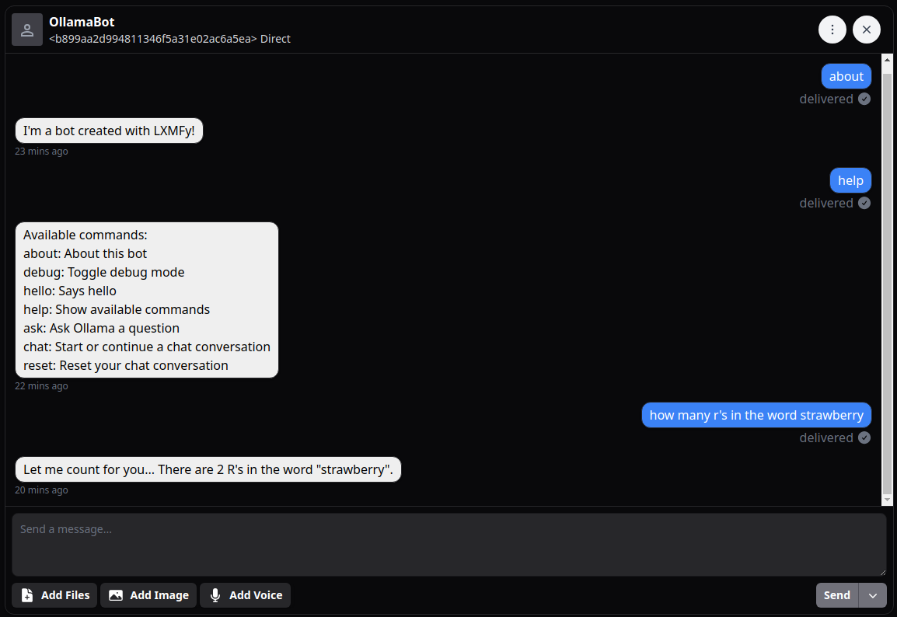

# ollama-bot

Interact with Ollama LLMs using LXMFy bot framework.

## Setup

`git clone https://github.com/lxmfy/ollama-bot.git`

`cd ollama-bot`

`cp .env-example .env`

edit `.env` with your ollama api url, model, and lxmf address.

## Installation and Running

`pipx install git+https://github.com/lxmfy/lxmfy.git`

`pipx run lxmfy-ollama-bot`

### Poetry 

`poetry install`

`poetry run lxmfy-ollama-bot`

## Commands 

Command prefix: `/`

`/help` - show help message

`/about` - show bot information

## Chat

Send any message **without** the `/` prefix to chat with the AI model.

The bot will automatically respond using the configured Ollama model.